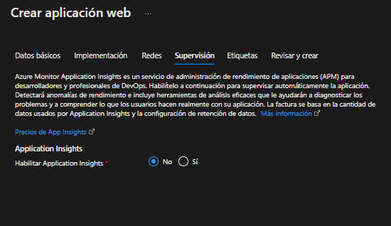

# Pre requisitos
- Cuenta de Azure
- Visual Studio 2022 o superior
- Bot Framework Emulator V4
- Azure CLI

# Creación de Recursos en Azure

<details open>
<summary>Grupo de recursos y Cognitive Service</summary>

1 Crear un grupo de recursos, para la implementación

2 Crear un cognitive service de LUIS (Language Understanding)


3 Configurar el servicio [LUIS](https://www.luis.ia), iniciar sesión con la cuenta de Azure

4 Para nuevos usuarios se necesita configurar el auth del servicio cognitivo


5 Para tener el servicio completo falta importar las intenciones y las entidades que conforman las respuestas del bot. Import -> import JSON -> buscar el archivo (CinemaBot.json) -> Nombre: CinemaBot

6 Una vez importando el JSON, manage -> Azure Resources -> Add prediction resource


7 Por ultimo hay que entrenar el modelo, dando click en Train, con esto el modelo esta listo para ser utilizado
</details>

<details>
<summary>Recurso de identidad</summary>

1 Abrir una terminal e introducir az login, con esto iniciaremos sesión a la cuenta de Azure, asociada al servicio cognitivo

2 Asociar la suscripción de la cuenta de Azure con:
```
az account set -- subscription "<id or name\>"
```
3 crear una identidad con:
```
az identity create --resource-group "<resource group name\>" --name "<identity name\>"
```
Se desplegara la siguiente información
```
{
  "clientId": "#######################",
  "id": "/subscriptions/####################/resourcegroups/grp-cinemabot/providers/Microsoft.ManagedIdentity/userAssignedIdentities/identity name",
  "location": "eastus",
  "name": "identity name",
  "principalId": "881642c6-80e2-4def-b66b-9795bc0fcf16",
  "resourceGroup": "resource group name",
  "tags": {},
  "tenantId": "######################",
  "type": "Microsoft.ManagedIdentity/userAssignedIdentities"
}
```
> Es importante guardar el clientId, name; posteriormente serán utilizados
</details>

<details>
<summary>Recurso bot</summary>

1 para crear un bot se ocupa el siguiente comando
```
az deployment group create --resource-group "<file arm\>" --parameters appId="<clientId\>" appType="UserAssignedMSI" tenantId="<tenantId\>" existingUserAssignedMSIName="<identity name\>" existingUserAssignedMSIResourceGroupName="<resource group name\>" botId="<bot name\>" botSku="S1"  --name "cinemaBot"
```
| Opción | Valor |
| ------ | ----- |
| appId | clientId del recurso de identidad |
|  appType  | UsserAssignedMSI |
|  tenantId  | tenantId de la suscripción |
|  existingUserAssignedMSIName | Plantilla ARM incluida en los archivos del proyecto |
| existingUserAssignedMSIResourceGroupName | resource group name |
| botId | bot name |
| botSku | F0 (gratis) o S1 (estandar) |
| name | nombre del despliegle |
</details>

<details>
<summary>App service</summary>

- Crear un App services, con los siguientes datos:



</details>

# Despliegue hacia Azure

Una configuración importante es entrar al recurso App service, buscar el url de acceso a la web; posteriormente entrar al recurso del bot, configuraciones, en la opción "Punto de conexión de mensajeria" reemplazar la url desde http hasta .net, por la url de acceso al App services. 

Para desplegar nuestro proyecto existen dos opciones:

a) Despliegue con CLI
- estar en la carpeta raíz, donde se encuentra el archivo .csproj
- Realizar una recompilación
- ejecutar el siguiente comando
```
az bot prepare-deploy --lang Csharp --code-dir "." --proj-file-path "<path file .csproj\>"
```

| Opción          | Valor                                       | 
| --------------- | ------------------------------------------- |
| lang            | Csharp                                      |
| code-dir        | Directorio para archivos de implementación  |
| proj-file-path  | Ruta de acceso al archivo .csproj           |

- Dentro del directorio raíz, crear un archivp ZIP con todos los archivos del proyecto
- ejecutar el siguiente comando
```
az webapp deployment source config-zip --resource-group "<resource group name\>" --name "<app services name\>" --src "<path file .zip\>"
```
b) Despliegue por perfil 
- Ir al recurso de App services
- Identificar el boton "Descargar perfil de publicación" y realizar la descarga
- Ir a Visual Studio, click derecho en el nombre del proyecto en la ventana de explorador de archivos de proyecto
- Dar click en Publicar
- Nuevo 
- Importar el perfil
- Publicar
